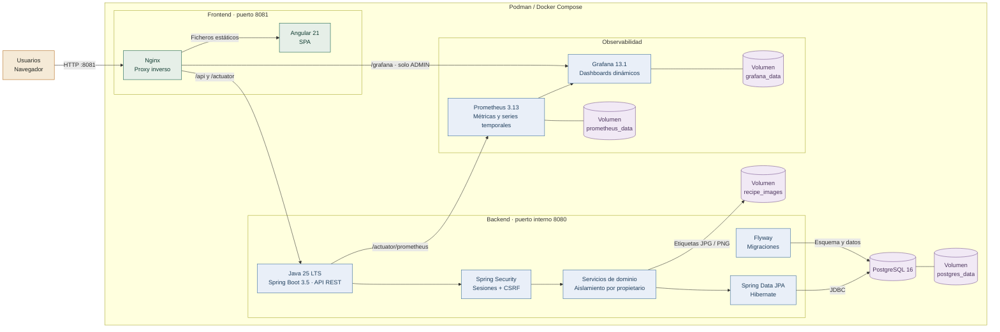
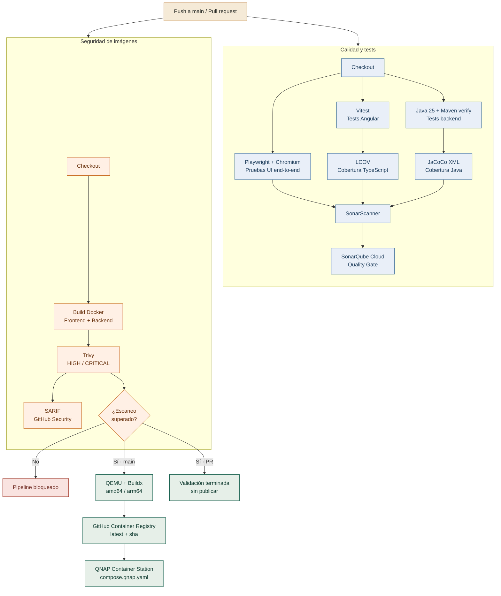

# Beer Designer

Aplicacion para disenar recetas de cerveza artesanal y sidra con referencia BJCP 2021 y BJCP Cider 2025, calculos y catalogos de ingredientes.

## Stack

- Frontend: Angular 21 con componentes standalone y formularios reactivos.
- Backend: Java 25 LTS + Spring Boot 3.5 + Spring Data JPA/Hibernate.
- Base de datos: PostgreSQL 16.
- Observabilidad: Prometheus 3.13 + Grafana 13.1.
- Contenedores: Podman/Docker.
- Datos iniciales: scripts SQL generados desde los catalogos XML de `public/assets/data`.

## Arquitectura

### Arquitectura de ejecución



El navegador solo accede al frontend. Las llamadas relativas a `/api` pasan por Nginx, que las reenvía al backend dentro de la red de contenedores. La ruta `/grafana` pasa primero por la autorización administrativa de Spring Security. Prometheus recoge las métricas de Spring Boot cada 15 segundos y Grafana actualiza el dashboard cada 10 segundos. PostgreSQL, imágenes, métricas y configuración de Grafana se conservan en volúmenes independientes.

### Pipeline CI/CD



Los dos análisis se ejecutan de forma independiente. En pull requests se validan tests e imágenes sin publicar artefactos; en `main`, las imágenes solo se publican en GHCR después de superar Trivy.

## Funcionalidad actual

- Navegador de estilos BJCP 2021 y BJCP Cider 2025.
- Lista y detalle de recetas de ejemplo.
- Creacion/edicion de recetas en frontend.
- Calculos de OG, FG, ABV, IBU y SRM.
- Comparacion de receta contra rangos BJCP.
- Catalogos de estilos, lupulos, maltas, levaduras y perfiles de agua.
- Backend REST con lectura desde PostgreSQL.
- Dashboard de observabilidad con tráfico HTTP, latencia, errores, JVM y conexiones PostgreSQL.
- Cuentas de usuario, login/logout, avatar propio o de galería y cambio de contraseña.
- Recetas, elaboraciones, breweries, perfiles y stock aislados por usuario.
- Catálogo base compartido y catálogo personal de ingredientes claramente identificado.
- Panel de administración con usuarios, roles, estado, actividad y conteos de contenido.
- Community con novedades, recetas públicas, autores y plantillas oficiales copiables al recetario personal.
- Publicación controlada por cada autor y gestión administrativa de recetas baseline.

## Acceso y administración

La migración multiusuario conserva los datos existentes y los asigna al administrador inicial:

```txt
Email: admin@beerdesigner.local
Contraseña local inicial: BeerDesigner-Admin-2026!
```

La cuenta obliga a cambiar la contraseña. En cualquier despliegue que no sea exclusivamente local define
`ADMIN_EMAIL`, `ADMIN_PASSWORD` y `ADMIN_NAME` antes del primer arranque. Las sesiones usan una cookie
`HttpOnly`, token CSRF separado, caducidad configurable y contraseñas BCrypt. Para servir exclusivamente por
HTTPS establece `AUTH_SECURE_COOKIE=true`.

Los usuarios normales pueden crear ingredientes y perfiles propios. Los registros del catálogo global se
marcan como «Sistema»; cuando un usuario modifica uno, se crea una copia personal. Solo el administrador puede
importar XML o publicar cambios en el catálogo global.

Community conserva la receta original bajo el control de su autor. Al copiar una receta pública o una plantilla
oficial se crea una receta nueva e independiente en la cuenta del usuario. El panel administrativo permite
publicar baselines y revisar usuarios, última actividad, recetas, elaboraciones e ingredientes. Grafana también
queda reservado exclusivamente a cuentas con rol `ADMIN`, tanto en la interfaz como en el proxy inverso.

## Desarrollo frontend

Instala dependencias:

```bash
npm install
```

Arranca Angular:

```bash
npm start
```

Abre:

```txt
http://localhost:4200
```

Build de produccion:

```bash
npm run build
```

Pruebas frontend y de interfaz:

```bash
npm run test:coverage
npx playwright install chromium
npm run test:e2e
```

Para desarrollar o depurar visualmente una prueba Playwright:

```bash
npm run test:e2e:ui
```

## Backend

Compila el backend:

```bash
cd backend
mvn -B package -DskipTests
```

Arranca el backend contra PostgreSQL local:

```bash
cd backend
SERVER_PORT=8082 java -jar target/beer-designer-backend-0.1.0-SNAPSHOT.jar --debug=false
```

Endpoints principales:

```txt
GET http://localhost:8082/api/health
GET http://localhost:8082/actuator/health
GET http://localhost:8082/api/catalog/bjcp-styles
GET http://localhost:8082/api/catalog/hops
GET http://localhost:8082/api/catalog/malts
GET http://localhost:8082/api/catalog/yeasts
GET http://localhost:8082/api/catalog/water-profiles
GET http://localhost:8082/api/recipes
GET http://localhost:8082/api/recipes/sample-american-ipa
```

## Podman

La guia completa para construir y levantar frontend, PostgreSQL y backend esta en:

```txt
docs/podman.md
```

Estado local usado durante el desarrollo:

```txt
Frontend: http://localhost:8081
Backend:  http://localhost:8082
Postgres: localhost:5432
```

## Despliegue QNAP / GHCR

El workflow de GitHub publica dos imagenes:

```txt
ghcr.io/josekero/beer_designer:latest
ghcr.io/josekero/beer_designer-backend:latest
```

Para Container Station usa `compose.qnap.yaml`. Ese compose levanta:

```txt
frontend -> Nginx + Angular, puerto 8081
backend  -> Spring Boot + Flyway, interno en puerto 8080
postgres -> PostgreSQL 16 oficial
prometheus -> series temporales de Actuator/Micrometer
grafana -> dashboard de analítica en /grafana
```

El frontend llama a la API con ruta relativa `/api`. Nginx reenvia esa ruta al servicio interno `backend:8080`, por eso no debe aparecer `localhost:8082` dentro del bundle de produccion.

En QNAP no hace falta montar `./db/init`: el backend lleva las migraciones Flyway dentro de `src/main/resources/db/migration` y las aplica al arrancar.

Si Container Station creo un volumen `postgres_data` durante un intento fallido con una base parcialmente inicializada, elimina ese volumen antes de volver a desplegar para forzar una inicializacion limpia.

El backend espera hasta 120 segundos a que PostgreSQL este disponible antes de fallar. Ademas, `compose.qnap.yaml` incluye healthchecks para ordenar mejor el arranque:

```txt
postgres healthy -> backend healthy -> frontend
```

## Base de datos

Los scripts de inicializacion viven en:

```txt
db/init/01_schema.sql
db/init/02_seed_catalog.sql
```

Regenerar seed desde los datos XML:

```bash
node scripts/generate-postgres-seed.mjs
```

## GitHub

El repositorio ya esta inicializado con rama `main`.

Primer commit:

```bash
git add .
git commit -m "Initial beer designer stack"
```

Conectar con GitHub:

```bash
git remote add origin git@github.com:TU_USUARIO/TU_REPO.git
git push -u origin main
```

Si prefieres HTTPS:

```bash
git remote add origin https://github.com/TU_USUARIO/TU_REPO.git
git push -u origin main
```
